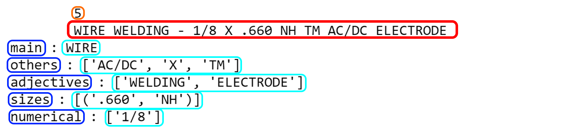

# NLP_MBTA
## NPL for assistant resarch for Shoshana Vasserman about MBTA

**Task:**
Form string descritions objects offered by sellers:
- [X] We need to make a "smart" *description* of these objects.
- [X] Then, we use this description to say if two objects are "*close*" of not, i.e.: make a distance function
- [X] Finally, we use a clustering alogorithm to make *sets* of objets that are "close".

**Note:** All task are made in the "NLP_main.ipynb" notebook, others files are just used for getting data from APIs, formating data, and make a few primary analysis.

**Note: (bis)** The data file isn't in this respository, for data-property reasons.

## The description of the objects is a dictionary:

RED: description of the object 
ORANGE: no. of the line in the datafile of the object 
Dark BLUE: keys of the dictionary decribing the object 
Light BLUE: coresponding values of the dictionary decribing the object 

## The distance function:

RED: description of the objects 
ORANGE: no. of the lines in the datafile of the objects 
BLUE: distance returned by the function in this case 

## The clustering results:

